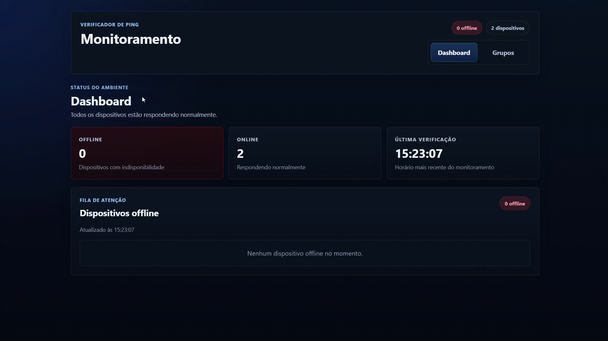

# Ping Verified Fullstack

Aplicação fullstack para cadastro e monitoramento de dispositivos, com arquitetura separada entre frontend e backend, foco em organização por domínio e base pronta para evolução.



## Live Demo

- Frontend (Vercel): [https://ping-verified-fullstack.vercel.app/#dashboard](https://ping-verified-fullstack.vercel.app/#dashboard)
- Backend/API (Render): [https://ping-verified-fullstack.onrender.com](https://ping-verified-fullstack.onrender.com)

Nota importante sobre o deploy:
- Este deploy público é voltado para demonstração de cadastro e fluxo da aplicação.
- O monitoramento real de ping em rede local não funciona no ambiente cloud, porque o servidor do Render não está na mesma rede Wi-Fi/LAN dos dispositivos privados.

## Destaques Técnicos

- Frontend em Vue 3 com arquitetura modular (`modules`, `shared`, `styles`).
- Backend em Node.js + Express com separação em camadas (`controllers`, `services`, `repositories`).
- Persistência em MongoDB Atlas.
- CORS configurável por variável de ambiente.
- Estratégia de monitoramento com fallback para ambientes que não permitem ICMP.

## Stack

- Frontend: Vue 3, Vite, Pinia, Axios
- Backend: Node.js, Express 5, Mongoose
- Banco de dados: MongoDB Atlas
- Deploy: Vercel (frontend) + Render (backend)

## Executando Localmente

1. Instalar dependências:

```bash
npm --prefix Backend install
npm --prefix Frontend install
```

2. Configurar variáveis de ambiente:
- Copiar `Backend/.env.example` para `Backend/.env`
- Copiar `Frontend/.env.example` para `Frontend/.env`

3. Subir aplicação:

```bash
npm run dev:backend
npm run dev:frontend
```

## Endpoints Principais

- `GET /health`
- `GET /devices`
- `POST /devices`
- `PUT /devices/:id`
- `POST /devices/bulk-delete`
- `GET /events`

## Documentação por Serviço

- Frontend: [Frontend/README.md](./Frontend/README.md)
- Backend: [Backend/README.md](./Backend/README.md)
